# Curso de Introducción a Machine Learning

## Modulo 1 Conceptos básicos de Machine Learning

### Clase 1 Bienvenida Curso de Introducción a Machine Learning

Bienvenida del curso por ricardo celis sobre algoritmos, tensores y redes neuronales, este curso es muy básico e introductorio, necesitas seguir profundizando y complementar con toros cursos.

### Clase 2 Introduccion a la terminologia de Machine Learning

El machine learning no es una moda pasajera, es algo que llego para quedarse y siempre le ha interesado a la humanidad.

**AI: Inteligencia Artificial.** Se refiere a la capacidad de una máquina de realizar tareas que deberían ser reservadas por la inteligencia humana, cumpliéndolas al mismo nivel o mejor.

**ML: Machine Learning.** Es un subcampo de la inteligencia artificial que involucra muchos datos para poder brindárselos de alguna forma a un software y que pueda resolver una tarea específica sin necesidad de que esté programada explícitamente para realizarla.

Dentro de ML tenemos tres tipos principales de algoritmos de aprendizaje:

**Supervised learning:** Este tipo requiere etiquetas, los datos tendrás etiquetas de sí o no.

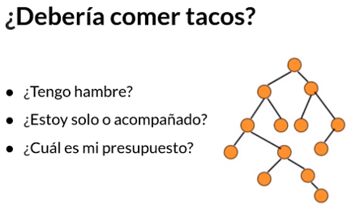

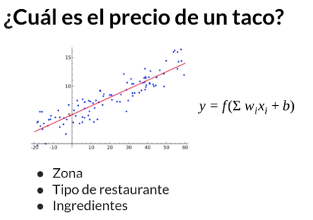

**Unsupervised learning:** Nuestras variables de entrada tendrán un peso para luego sumar esas variables y tendremos un resultado. Esto no es más que una regresión lineal.

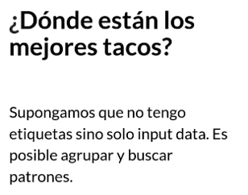

**Reinforcement learning:** Si solo tengo las variables de entradas. Se puede agrupar y buscar patrones. Tomar acciones para maximizar la recompensa en una situación específica. Toma las decisiones basados en experiencia. En el caso del software la recompensa sera una funcion matemática.

**DL: Aprendizaje profundo.** Es ML con redes neuronales de muchas capas que pueden aprender asociaciones entre entrada y salidas. Estas redes con diferentes nodos y se asemejan a como funciona una neurona del cuerpo humano.

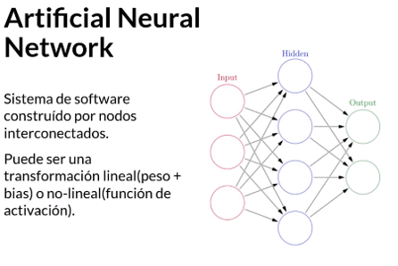

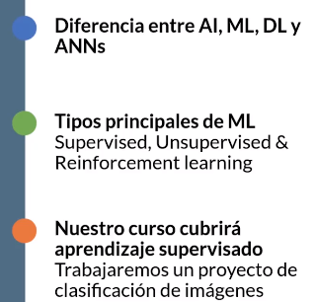

### Clase 3 Terminologia y regresion lineal

La regresión lineal nos va a dar justo lo que queremos como resolución de un problema de ML. Partimos de una ecuación, la **Y** será nuestro **label** o **variable que estamos prediciendo**, la **X** que será nuestra **variable de entrada** y le llamaremos **feature**.

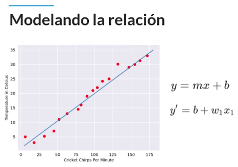

**Modelo:** Una vez construyamos nuestro modelo con los datos históricos, vamos a predecir el futuro y que la máquina pueda tomar esas decisiones con lo ya aprendido. El modelo define la relación entre features y labels.

**Training:** Para lograr predecir el futuro, tendremos una etapa de entrenamiento. En esta etapa aprenderá cómo se relacionan las variables. Darle  un dataset al modelo y permitirle aprender de datos con label

**Inference:** Usar nuestro modelo para realizar predicciones

#### Construyendo un modelo

Para construir un modelo usamos las variables de entrada siendo necesario normalizar una para tener una representación numérica y construimos una ecuación.

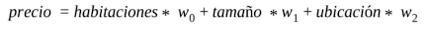

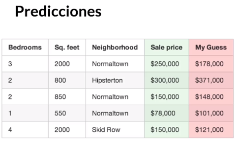

La diferencia que puede haber entre el resultado y el valor real debemos tratar de que no exista para que la predicción sea lo más cercana posible al valor real, no será al 100%, pero la diferencia o pérdida debe ser baja. Para llegar a eso debemos escoger el peso correcto, nuestro objetivo sera reducir el loss para tener un resultado lo mas cercano al valor real.

### Clase 4 Training &amp;Loss: Entrenando y ajustando nuestro modelo

En esta clase hablaremos del proceso de entrenamiento y cómo minimizar la pérdida. Queremos que nuestro modelo quede de la mejor forma posible

Nuestro objetivo es **minimizar la pérdida**.

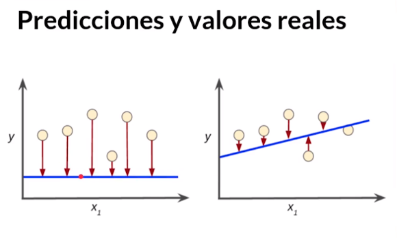

Como podras notar en el primer modelo el tamaño de las flechas es mucho mayor que en el segundo, lo que se traduce en mayor perdida para el primero.

Para calcular el error usamos una fórmula llamada MSE(Mean Squared Error), este penaliza el error cuando la distancia entre la recta y los puntos aumenta.

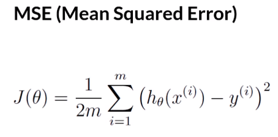

O en su representación mas mundana, aunque computa
cionalmente sea mas costoso.

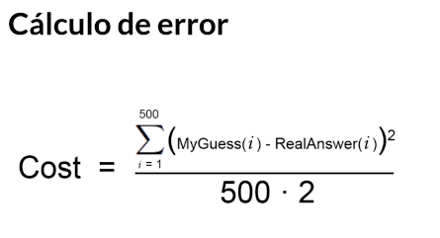

Ahora, quiero minimizar esa diferencia de forma mas eficiente, ¿como lo hago?, sera a traves de **gradiente** (_un vector con dirección y magnitud_, y lo voy a calcular con una derivada parcial, esta nos indica en que dirección movernos).

**Stochastic Gradient Descent(SGD):** Es estocástico porque será aleatorio y tenemos opciones para realizar el gradiente en busca del mínimo.

- ¿Deberíamos calcular el gradiente de todo el dataset?

- Puede ser más eficiente elegir ejemplos aleatorios.

- Un solo ejemplo es muy poco, trabajamos con un batch.

#### El proceso de aprendizaje

- Requiere iniciar los pesos de los valores para calcular la pérdida que estamos teniendo, con la ecuación vista tendremos una idea de qué tan lejos está nuestra predicción de lo real y así evaluar el desempeño de nuestro modelo. Repetimos utilizando el gradiente como referencia para acércanos al peso donde podemos minimizar la pérdida.

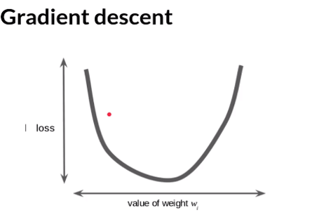

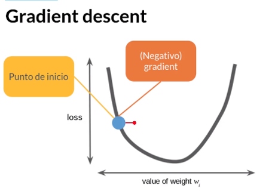

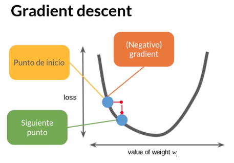

- La fase de entrenamiento es un proceso iterativo

- Al calcular el error(loss), el gradiente nos ayuda a buscar el mínimo

- Es necesario calibrar el valor de learning rate

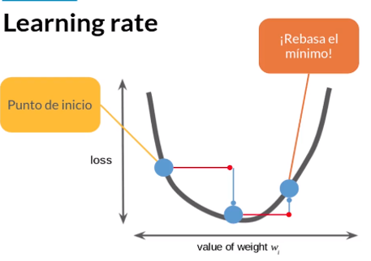

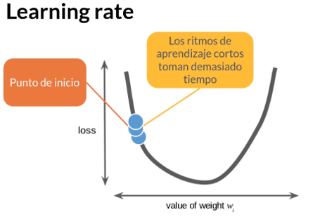

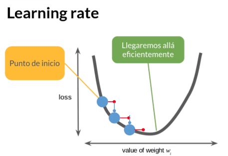

## Modulo 2 Trabajando con Pytorch

### Clase 5 Introducción a Pytorch, trabajar con tensores y representar datasets con tensores

PyTorch es un framework, va a ser nuestro apoyo con características importantes como múltiples funciones que nos ayudan en la construcción de nuestro modelo. Implementaremos una regresión lineal y otras aproximaciones de modelos de clasificación, para cada uno de estos casos utilizaremos módulos del framework.

Proceso de aprendizaje

- Forward pass (predicción)
- Backpropagation (regresamos e iteramos)
- Optimización

Al trabajar con PyTorch o algún framework de ML nuestra herramienta principal son los tensores.

**Un tensor no es más que una generalización**, no es más que una estructura de datos que nos permite representarlo de manera genérica

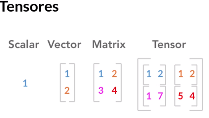

Google Collaboratory es una implementación de Jupyter Notebooks que esta en la nube. No requerimos configurar nada.

Aquí la documentación de [pytorch](https://pytorch.org/tutorials/)

### Clase 6 Trabajando con tensores

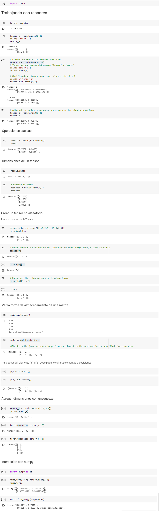

### Clase 7 Representando datasets con tensores

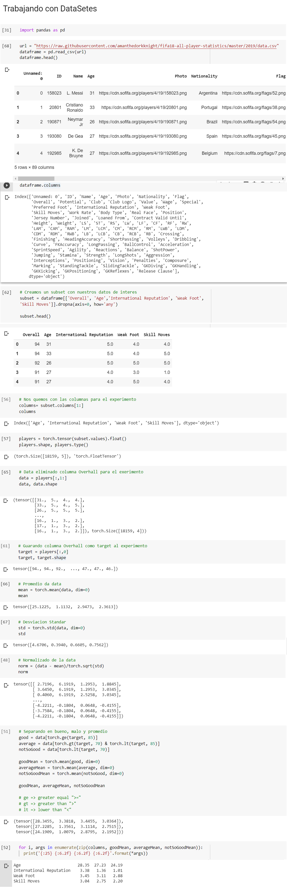

## Modulo 3 Implementaciones de algoritmos de Machine Learning en Pytorch

### Clase 8 Implementación de regresión lineal en Pytorch, Regresión logística, Implementación de regresión logística en Pytorch

En esta clase vamos a trabajar en una implementación práctica de la regresión lineal, el ejemplo que vimos sobre el precio de los tacos, calcular el loss function y lo implementaremos con PyTorch con alguno de sus módulos. También veremos cómo graficar datos.

### Clase 9 Regresion logistica

**La regresión logística es un mecanismo eficiente para calcular probabilidades. El resultado puede utilizarse tal cual o convertirlo a una categoría binaria (para clasificar)**, para lograr esto nos apoyamos en una función matemática llamada **Sigmoide**. Si en caso la clasificación tuviera **más parámetros**, haríamos uso de la función **Softmax** para generalizar.

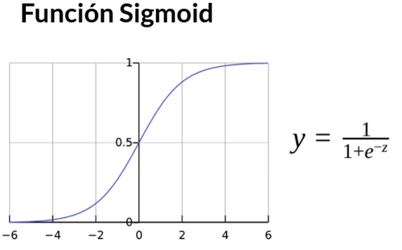

A la regresión lineal también se le agrega el sigmoide que nos dará una probabilidad de salida y con ello resolvemos nuestro problema de pasar una regresión lineal a una regresión logística y debido a este cambio el **MSE ya no será mi mejor forma de calcular el LOSS**. Debe cambiar.

La aproximación intuitiva es castigar cuando el valor es 0 y la predicción resulta en 1 o viceversa. Esto se logra con el logaritmo porque nos permite modelarlo perfectamente y ahora **nuestra función de pérdida o LOSS va a incluir logaritmos**.

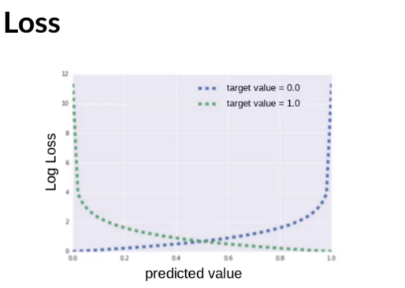

Para problemas de probabilidad, utilizamos una regresión logística
Para calcular el error(loss), nos basamos en la **entropía** pero el gradiente sigue siendo útil

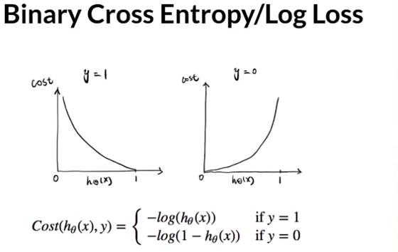

Los problemas de categorías y probabilidad los resolvemos con una regresion logistica, los numéricos con una regresion lineal.

Otros recursos
<https://www.youtube.com/watch?v=KN167eUcvrs>
<https://www.youtube.com/watch?v=5YyDu5rO3kE>
<https://www.youtube.com/watch?v=HFswrM68yPU>

### Clase 10 Implementacion de regresion logística en Pytorch

En esta clase implementaremos en PyTorch la regresión logística. Empezaremos generando unos datos, separarlos (para que sea mucho mas obvia la clasificación) y construir el modelo para ver cómo nos queda nuestra predicción

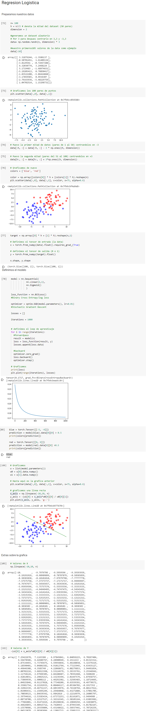

## Modulo 4 Redes Neuronales y reconocimiento de imágenes

### Clase 11 Como funciona el reconocimiento facial

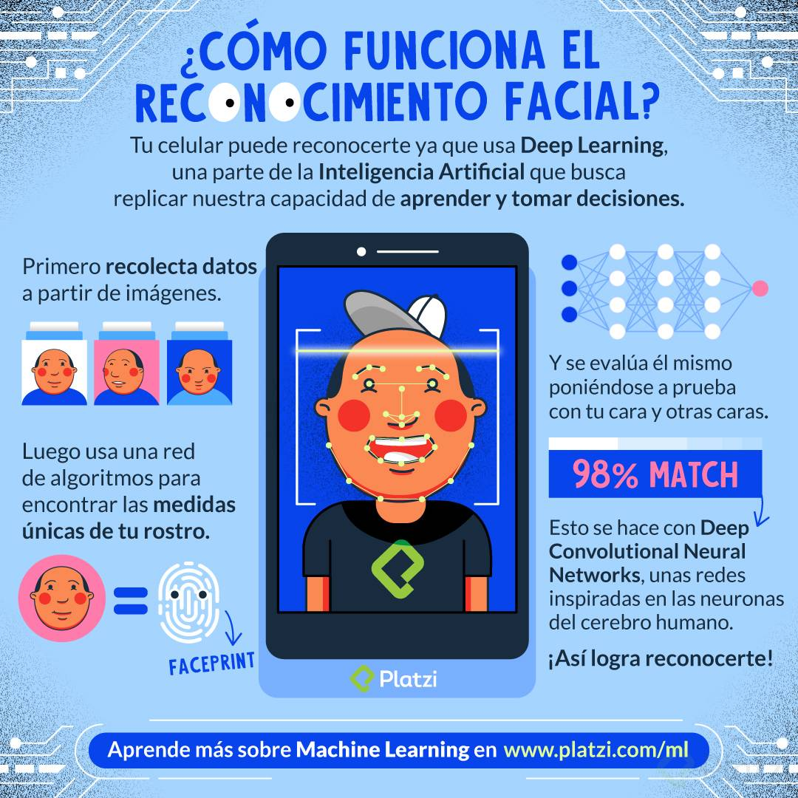

### Clase 12 Neuronas y funcion de activacion, Usando un modelo pre entrenado para reconocimiento de imagenes, Trabajando un dataset

En la vida real la mayoría de problemas que vamos a resolver no serán lineales, afortunadamente tenemos varias herramientas que nos permiten modelarlo. Para esto necesitamos a las redes neuronales artificiales.

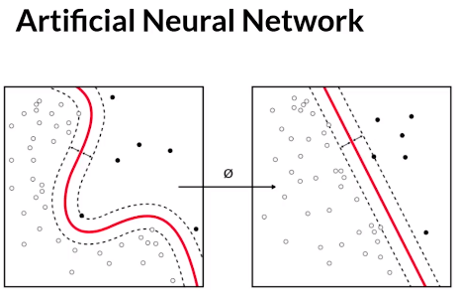

Con una capa oculta se agregan nodos y existirá una conexión entre ellos, estas pueden variar siendo de una o múltiples vías. También se pueden moderar de varias formas y cada una de estas capas puede variar dependiendo de la cantidad de capas ocultas que tengamos.

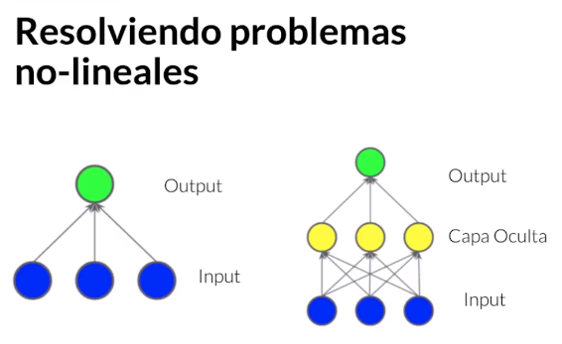

Cada neurona tiene una función de activación y nos va a permitir conectar las múltiples capas para realizar la transformación de lineal a red neuronal.

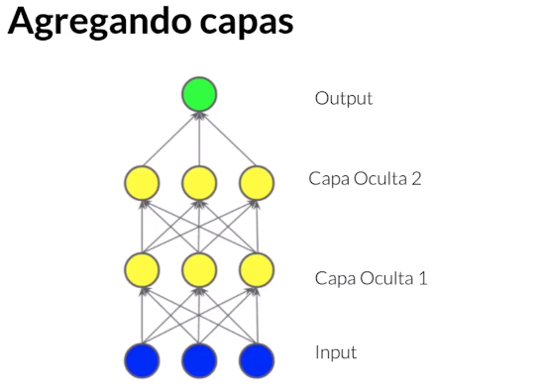

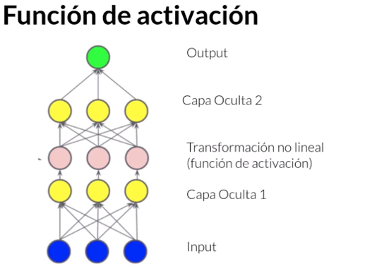

**Perceptrón:** Neurona básica. Tendrá la entrada, salida y una función en medio. Normalmente trabaja con la **función escalón de Heaviside**. A esto se le puede agregar complejidad y funciones de activación como **Sigmoid, Tanh, ReLUs** y otras más.

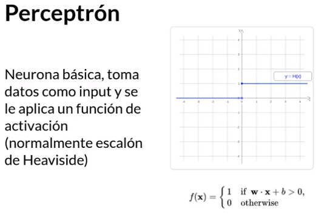

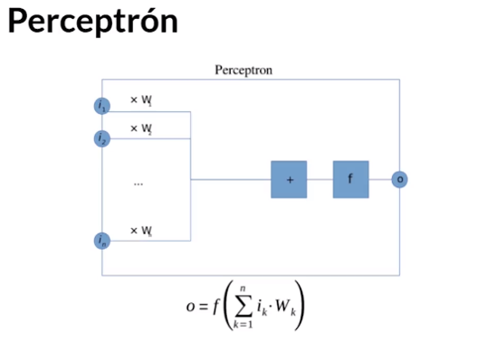

**Tanh:** Se puede modelar como un caso específico del Sigmoid, nos ayuda porque esta escalado. La curva es diferente y puede saturarse en algunos casos.

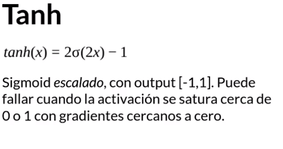

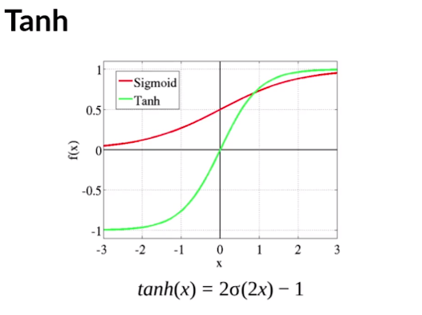

**ReLU:** Evita el problema de vanishing gradient pero solo puede utilizarse en las hidden layers de una NN. Existen variantes para evitar algunos de los problemas más comunes como neuronas muertas.

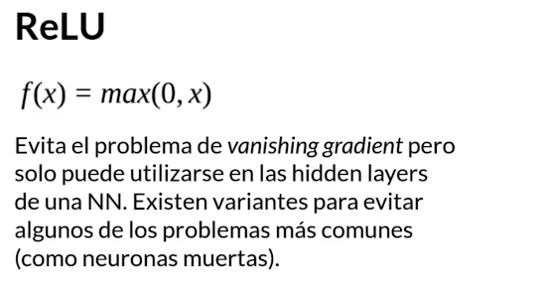

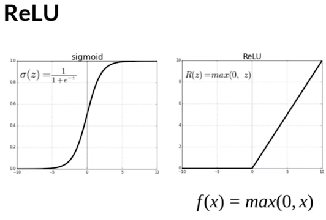

#### Contenido adicional

[¿Qué es una Red Neuronal? Parte 1 : La Neurona | DotCSV](https://www.youtube.com/watch?v=MRIv2IwFTPg&t=2s)

[¿Qué es una Red Neuronal? Parte 2 : La Red | DotCSV](https://www.youtube.com/watch?v=uwbHOpp9xkc)

[Jugando con Redes Neuronales - Parte 2.5 | DotCSV
](https://www.youtube.com/watch?v=FVozZVUNOOA)

### Clase 13 Usando un modelo pre entrenado para reconocimiento de imágenes

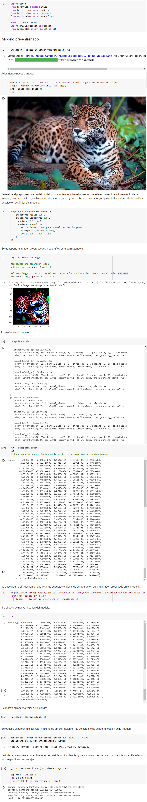

### Clase 14 Trabajando un dataset

 El primer paso para implementar un modelo es trabajar con el set de datos, siempre hay un punto específico en el cual es importante poner atención. En este caso, al trabajar con machine learning, los datos son muy importantes y por eso tenemos este paso.

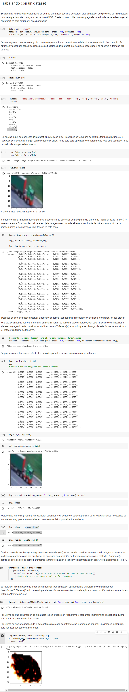

## Modulo 5 Reconocimiento de imágenes

### Clase 15 Construyendo un modelo, Implementando un clasificador totalmente conectado, Mejoras, limitaciones y conclusiones

Hasta el momento en modulos anteriores vimos como usar un modelo pre-entrenado para reconocer imagenes, y empezamos a trabajar con un dataset, en base a ese dataset vamos a construir nuestro propio modelo vamos a hacer un clasificador binario de imagenes, usando CIFAR 10 vamos a identificar si una imagen es un gato o un automóvil.

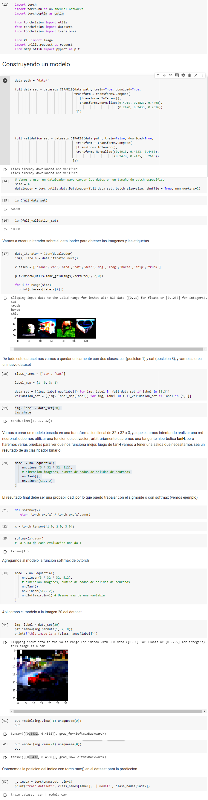

### Clase 16 Implementando un clasificador totalmente conectado

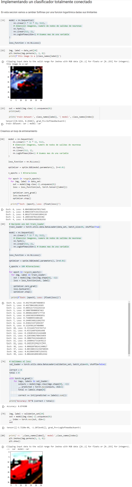

### Clase 17 Mejoras, limitaciones y conclusiones

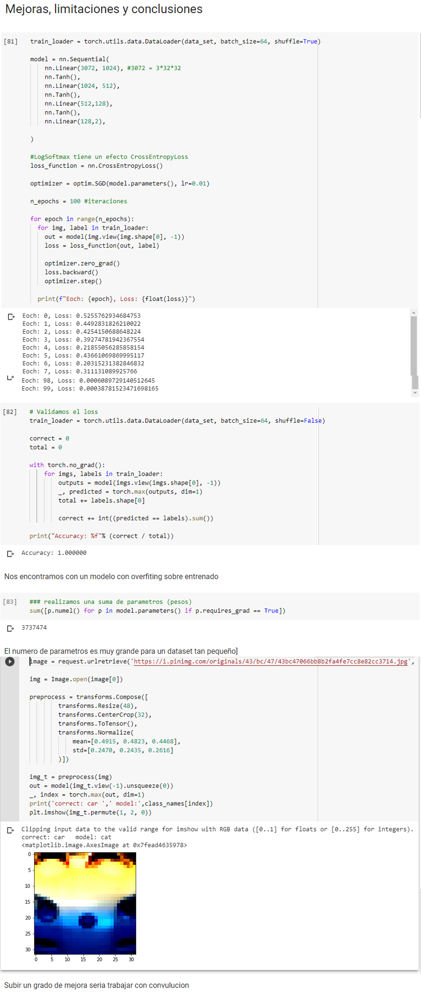

## Modulo 6 Collab con Scikit

### Clase 18 Aprende a usar Collab con scikit

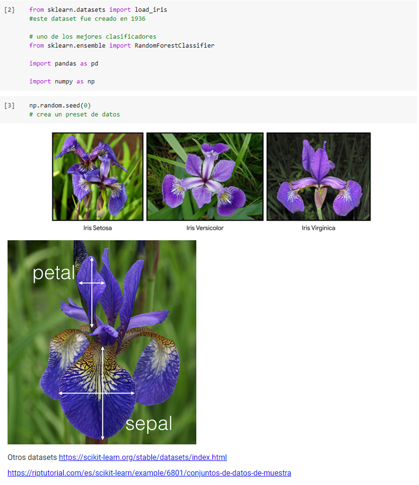

### Clase 19 Demo con Scikit: division de datos

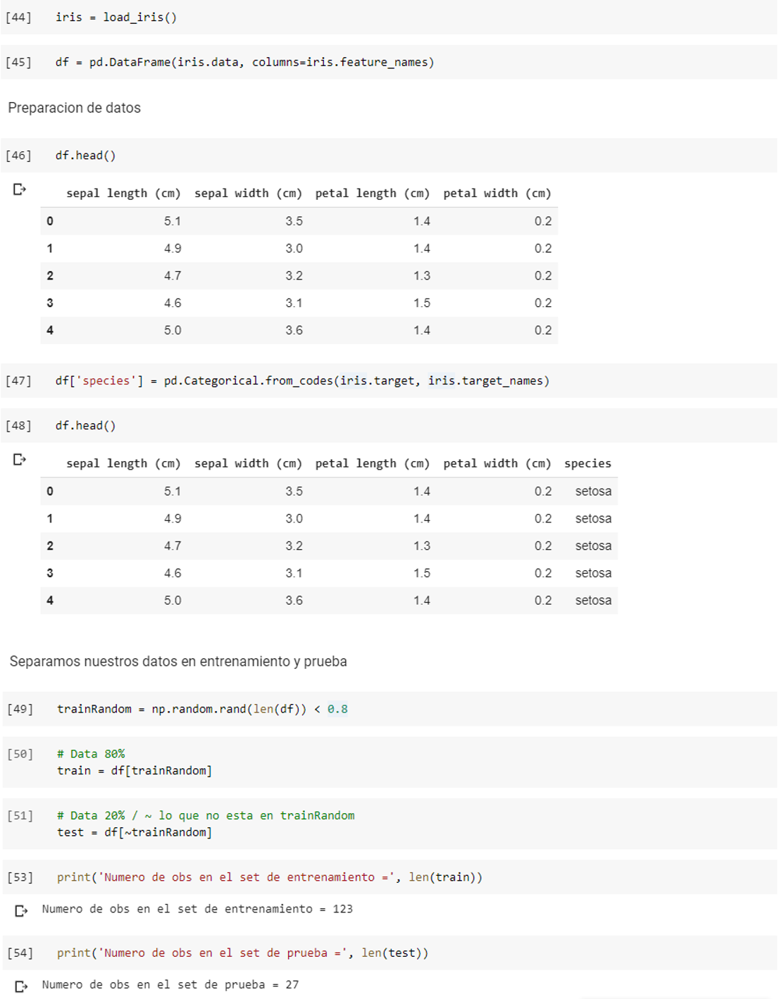

### Clase 20 Demo con Scikit: validación de datos

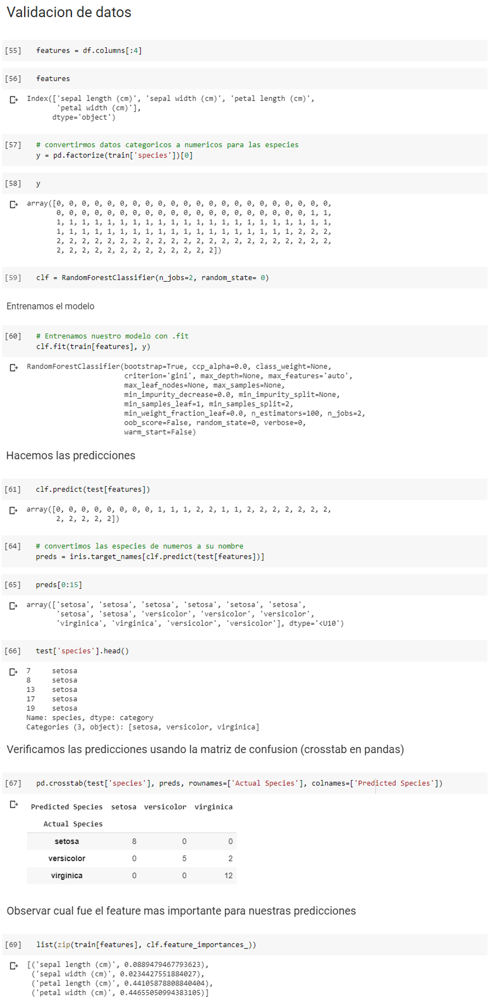

## Modulo 7 Algoritmos más usados en Machine Learning

### Clase 21 Los algoritmos más usados en Machine Learning

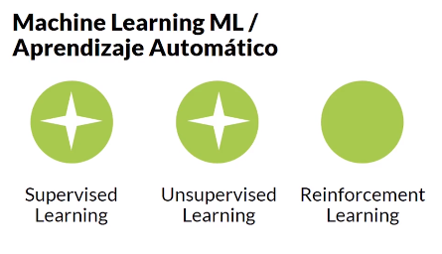

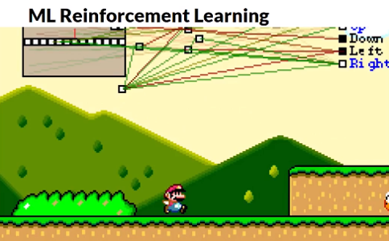.

**- Aprendizaje supervisado:** Basado en etiquetas.

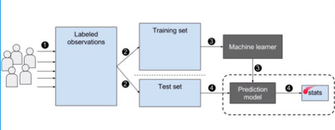

**- Aprendizaje no supervisado:** Automáticamente detecta patrones, con ello agrupa los  datos.

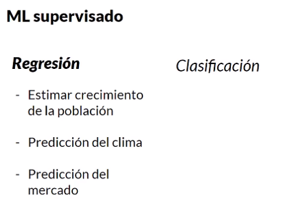

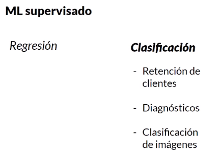

### Clase 22  Algoritmos supervisados en Machine Learning

#### ML Supervisado - Algoritmos

**Naive Bayes:** Clasificación, la probabilidad de que un usuario pertenezca a este grupo de (compras, gustos, etc), asume de forma ingenua (Naive) la independencia entre cada par de features, los features son aquellos que nos dan información especifica de cada problema, no hace ninguna  relacion, pero trata de ir agrupando la información en base a los pesos que tiene cada feature.

**Hint:** Prueba este algoritmo cuando tengas **problemas de clasificación**.

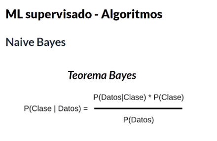

**K-nearest neighbors:** Algoritmo de clasificación, usa la medida de las distancias del agrupamiento

- Euclidiana
- Hamming
- Manhattan

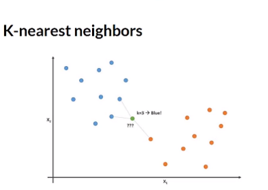

**Arbol de desiciones:** Sirve para regresiones o clasificaciones.

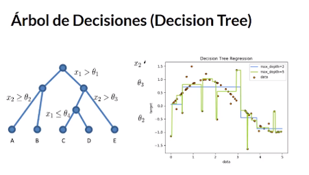

Ten cuidado con el overfitting porque vas a perder datos nuevos como en la figura dos

**Random Forest:** Es un algoritmo que **ensambla** varios algoritmos (arboles), este es un excelente clasificador.

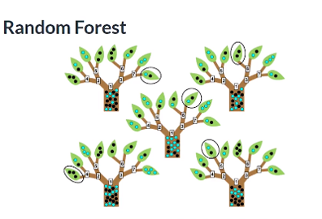

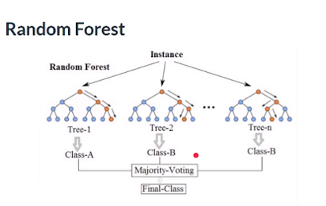

Siempre entra a la documentación (en este caso Sklearn)

<https://scikit-learn.org/stable/modules/generated/sklearn.ensemble.RandomForestClassifier.html>

**Redes Neuronales:** Permiten aprender de forma supervisada con información etiquetada, funcionan como un ensamble y rebotando información entre si.

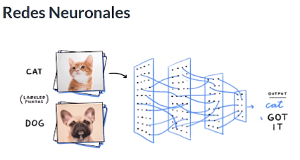

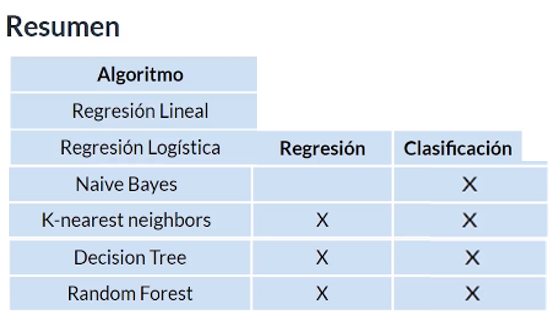

### Clase 23 Algoritmos no supervisados en Machine Learning

#### ML No supervisado

- Clusters - Agrupamiento

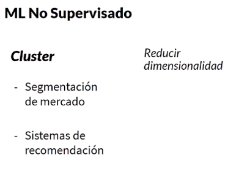

- Reducción de dimensionalidad

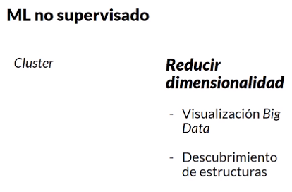

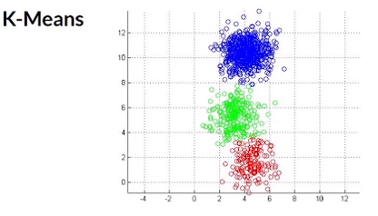

## Modulo 8 Bonus: Redes neuronales y herramientas

### Clase 24 Qué es lo que está detrás de una red neuronal

Reforzaremos los conceptos aprendidos con anterioridad con la siguiente herramienta.

<https://playground.tensorflow.org/#activation=relu&regularization=L1&batchSize=10&dataset=gauss&regDataset=reg-plane&learningRate=0.003&regularizationRate=0.001&noise=50&networkShape=8,8,8,8,8,8&seed=0.15829&showTestData=true&discretize=false&percTrainData=10&x=true&y=true&xTimesY=false&xSquared=false&ySquared=false&cosX=false&sinX=false&cosY=false&sinY=false&collectStats=false&problem=classification&initZero=false&hideText=false>

Hits: Puedes vencer al overfitting de dos maneras, usando una funcion de regularización (L1 o L2) y deteniendo las iteraciones alcanzando un nivel de precision aceptable.

### Clase 25 Cómo funciona una red convolucional intuitivamente y porque son tan buenas con imágenes

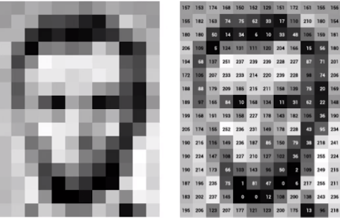

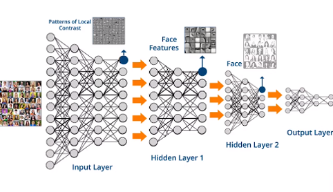

Una red convulucional identifica primero patrones de contraste (ojos, narices, bocas), en una siguiente capa oculta convierte estos patrones de contrate en caracteristicas de un rostro, posterior en otra capa estas se convierten en rostros completos. Vemos como va de lo particular hacia lo general, desde los átomos, estructuras a la materia.

Los patrones de contraste se encuentran comparando el gradiente entre los pixeles, toma en cuenta el valor del pixel tanto su contexto (como esta ubicado y su contenido respecto a otro)

Este enlace es una herramienta para visualizar como trabaja una red convolucional

<https://www.cs.ryerson.ca/~aharley/vis/conv/>

### Clase 26 Redes generativas

Una de las aplicaciones de las redes convolucionales son las redes generativas (deep fake).

Esto lo hace mediante un autoencoder

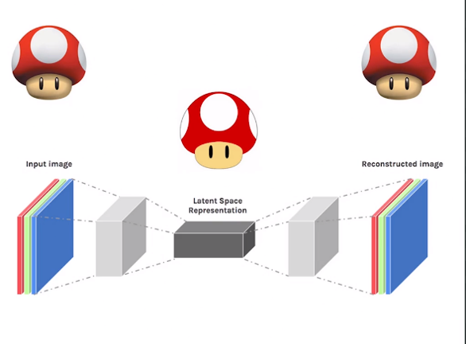

La mayoria de las imagenes fake son por redes generativas adversarias (enfrenta dos imagenes), una una red generadora y una discriminadora

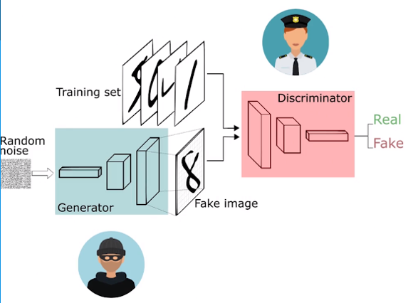

### Clase 27
## Modulo 9 Cierre

